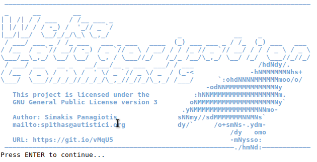
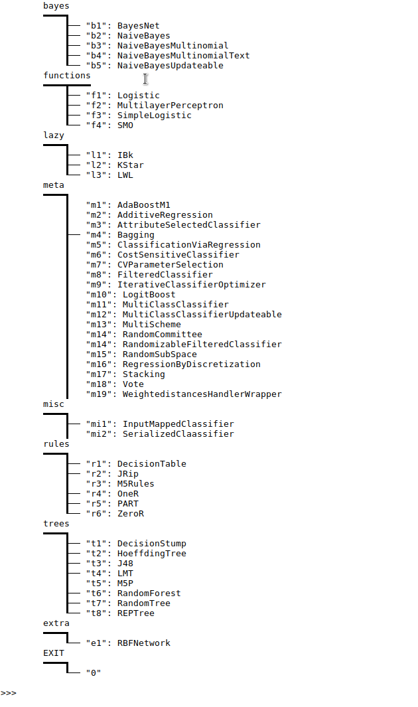

# Weka Categorization Commands
## Python project for running categorization experiments.
it's known that WEKA craches when the input dataset is too big. For this reason you have to run the algorithms from your terminal avoiding the GUI. Because the length of the commands is too big, I developed this programm which takes as input the installation directory of WEKA, the working directory and the filename of the dataset. Then a menu with available algorithms will appeared and you have to choose one. Finally when the algorithm has terminated the results is visible in the terminal.

---
## Built and run
```bash
git clone https://github.com/sp1thas/Weka-Categorization-Commands.git && cd Weka-Categorization-Commands
python WekaCommands.py
```

## Prerequirments
 - Python 2.7
 - WEKA
 - Your dataset


 ## Algorithms Availability

 | Bayes | Availability |
 |---|---|
 | BayesNet | ok |
 | NaiveBayes |ok |
 | NaiveBayesMultinomial | ok |
 | NaiveBayesMultinomialText | ok |
 | NaiveBayesUpdateable | ok |  

 | Functions | Availability |
 |---|---|
 | Logistic | ok |
 | MultilayerPerceptron | ok |
 | SimpleLogistic | ok |
 | SMO | ok |

 | Lazy | Availability |
 |---|---|
 | IBk | ok |
 | KStar | ok |
 | LWL | ok |

 | Meta | Availability |
 |---|---|
 | AdaBoostM1 | - |
 | AdditiveRegression | - |
 | AttributeSelectedClassifier | - |
 | Bagging | ok |
 | ClassificationViaRegression | - |
 | CostSensitiveClassifier | - |
 | CVParameterSelection | - |
 | FilteredClassifier | - |
 | IterativeClassifierOptimizer | - |
 | LogitBoost | - |
 | MultiClassClassifier | - |
 | MultiClassClassifierUpdateable | - |
 | MultiScheme | - |
 | RandomCommittee | - |
 | RandomizableFilteredClassifier | - |
 | RandomSubSpace | - |
 | RegressionByDiscretization | - |
 | Stacking | - |
 | Vote | - |
 | WeightedistancesHandlerWrapper | - |

 | Misc | Availability |
 |---|---|
 | InputMappedClassifier | - |
 | SerializedClaassifier | - |

 | Rules | Availability |
 |---|---|
 | DecisionTable | - |
 | JRip | - |
 | M5Rules | - |
 | OneR | - |
 | PART | - |
 | ZeroR | - |

 | Trees | Availability |
 |---|---|
 | DecisionStump | - |
 | HoeffdingTree | - |
 | J48 | ok |
 | LMT | - |
 | M5P | - |
 | RandomForest | - |
 | RandomTree | ok |
 | REPTree | ok |

 | EXTRA |
 |---|
 | RBFNetwork |


## Running

run python script. First insert the installation directory of Weka.


then insert the directory of the dataset



.. the filename of dataset



and finally choose the algorithm of your choise


and get the output

